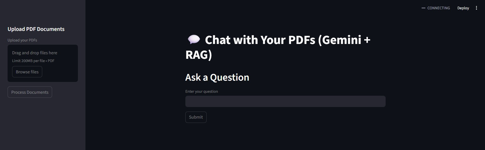

# Enterprise RAG Document Intelligence System

An end-to-end **Retrieval-Augmented Generation (RAG)** application that allows users to upload multiple PDF documents and interact with them using natural language queries.

The system uses **Google Gemini LLM**, **semantic vector search with FAISS**, and **document chunking** to retrieve relevant context and generate accurate answers.

---
## Application Interface


---

## Demo Features

* Upload and process multiple PDF documents
* Semantic document search using vector embeddings
* Context-aware question answering
* Gemini-powered responses
* Document chunking for scalable retrieval
* Streamlit interactive UI
* Retrieval pipeline visualization

---

## System Architecture

User Query
↓
Semantic Retrieval (FAISS Vector Database)
↓
Relevant Document Chunks
↓
Gemini LLM (Answer Generation)
↓
Final Response

Pipeline:

PDF → Text Extraction → Chunking → Embedding → FAISS Index → Retrieval → Gemini LLM → Answer

---

## Tech Stack

**Programming Language**

Python

**Libraries & Frameworks**

* Streamlit
* LangChain
* FAISS
* PyPDF2
* Python Dotenv

**AI Models**

* Gemini 2.5 Flash (LLM)
* Gemini Embedding Model

---

## Project Structure

```
enterprise-rag-system
│
├── app.py
├── requirements.txt
├── .gitignore
│
├── utils
│   ├── pdf_loader.py
│   ├── text_splitter.py
│   ├── vector_store.py
│   └── rag_chain.py
│
├── data
├── faiss_index
└── README.md
```

---

## Installation

Clone the repository

```
git clone https://github.com/YOUR_USERNAME/enterprise-rag-document-intelligence.git
```

Navigate to the project folder

```
cd enterprise-rag-document-intelligence
```

Create virtual environment

```
python -m venv venv
```

Activate environment

Windows

```
venv\Scripts\activate
```

Install dependencies

```
pip install -r requirements.txt
```

---

## Environment Setup

Create a `.env` file in the root directory.

```
GOOGLE_API_KEY=your_gemini_api_key
```

---

## Running the Application

Start the Streamlit server

```
streamlit run app.py
```

Then open the browser and upload PDFs to start querying.

---

## Example Workflow

1. Upload financial reports or research papers
2. System extracts and chunks text
3. Embeddings are generated and stored in FAISS
4. User asks a question
5. Relevant document chunks are retrieved
6. Gemini LLM generates the final answer

---

## Example Use Cases

* Financial document analysis
* Research paper exploration
* Internal company knowledge base
* Contract and legal document Q&A
* Educational material querying

---

## Future Improvements

* Hybrid retrieval (Vector + Keyword search)
* RAG evaluation metrics
* Retrieval visualization
* Streaming responses
* Support for DOCX, TXT, and Web documents

---

## Author

Madan Dahiphale

LinkedIn
[www.linkedin.com/in/madandahiphale](http://www.linkedin.com/in/madandahiphale)
